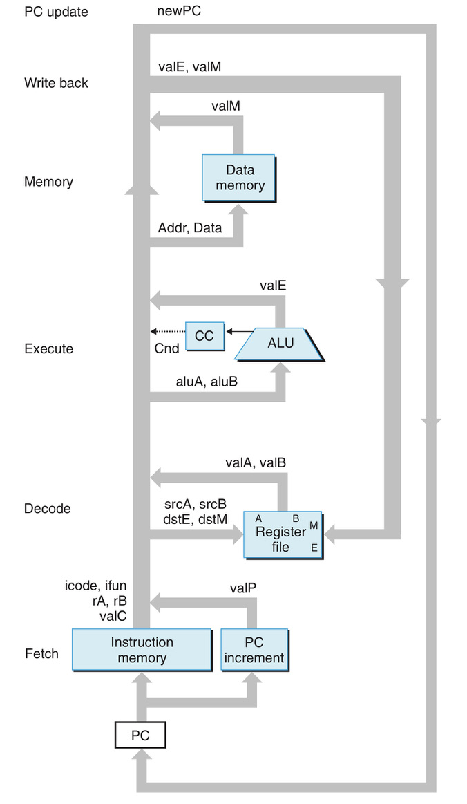

## 基础

在这里我们不讲什么变量定义，控制语句，关键词之类的基础，我们只讲那些，Rust独有的，比较有难点的东西。

### 基本类型

Rust的基本类型包括：

- i家族：i8 i16 i32 i64 i128

- u家族：u8 u16 u32 u64 u128

- f家族：f32 f64

- bool

- char，注意，Rust的Char是UTF-8编码的，即'🥺'算是一个字符。这也导致对于字符串的处理需要额外小心。

此外，Rust还有一些特殊类型，除去元组这个某些语言有，某些语言没有的东西，另外就是单元类型：()和发散类型：! 对没错，小括号和感叹号是两个类型。

#### 独有类型

**单元类型**类似Go的空结构体，可以**作为占位符**使用，也可以**作为C的void**使用，单元类型的值就是()，是的，它类型和值都是小括号。而且它**表示函数返回空**，比如main()函数可以理解成main返回单元类型，即返回空。

此外，在Rust中函数返回空是算返回值的，真正**没有返回值的是发散类型**，即返回值为!的函数，它**表示函数永不返回**，可以用于指出某一函数尚未实现。

### 所有权机制

首先，所有语言都无法回避的一个事实是资源回收问题，而这个问题的典型就是内存回收，所以编程语言分为了两大类：手动回收内存和GC回收。然而Rust选择了第三种方式：编译器回收，即所有权系统。

- 所有权系统：解决内存释放问题和二次释放问题。

- 生命周期系统：解决悬垂引用问题。

Rust中的一个普通的赋值语句：let a = XXX；a称为变量，即variable；而XXX称为内存对象，也叫做值，即value。每一个赋值操作称为值绑定，因为此时不仅仅对变量进行了赋值，我们还把值的所有权一并加到了变量上。

- Rust中一个值只有一个变量拥有它的所有权

当**拥有所有权的变量离开了自己的作用域**时，与它**绑定的值就被析构函数释放**了，进而完成资源的释放。或者说，所有权保证了值的生存，值一旦失去所有权，就会被释放，而所有权是变量负责保存的。

使用变量a给另一个变量b赋值，会发生所有权转移，此时新的变量b将对值负责，a也**无法再次使用**。

- 所有权是一个编译器抽象的概念，它不存在于实际的代码中，它仅仅是一种思想。

### 所有权和Copy

不是每一次赋值操作都会导致所有权转移，对于T类型而言，使用变量a对变量b进行赋值，如果**T实现了Copy**，那么**会发生一次副本操作**，即，发生一次完整的内存复制，此时**a和b各自绑定独立的值**，互不干扰，只是它们的值内容相同。

而**没有实现Copy**的类型，则**会发生所有权转移**，又称为“**移动**”，此时除了所有权转移，**同样会发生值的复制**，就和C语言的普通赋值一样，只是这一次所有权不会复制，a的值将被释放，因为它的值的所有权被移走了。还记得我们前面说的吗？失去了所有权的值将被释放。但是此时新的变量的值是旧变量的副本。

这样来看，Copy仅仅保证所有权是否被Duplicate。

### Copy和Clone

既然说到了Copy，顺嘴提一下Clone。Clone是Copy的父trait。实现了Copy的T类型必须实现Clone。

- Copy：强调位复制，且仅作用于存储在栈上和**非Drop**的类型。由编译器实现，无法自行实现。

- Clone：强调副本有效性，会进行深拷贝，保证新的值完全有效。可由用户自行实现。

更加详细地见[这里](https://rustcc.cn/article?id=c3fc25cf-dab6-4b51-8547-1ff4aacbfc32)

Copy本质是一个编译器trait，用于标注一个类型是否可Copy。它无法被主动实现，想要某个T类型实现Copy，可通过派生宏进行派生，**当且仅当所有字段均是Copy类型是，T才是Copy的**。

一般而言，基本类型都是Copy的，数组或元组的元素类型全部是Copy的，数组或元组才是Copy的。

### 不想要所有权？引用登场

有些时候我们仅仅想要使用对象，而不想获得所有权，比如一个打印函数，肯定只想读取变量，不然打印完还要把所有权返回出去可太麻烦了！此时我们引入**引用**这个概念。

引用正如绝大多数语言中的指针。对于T类型，它的引用类型是&T，是一个指向内存对象的指针，引用变量保存着内存对象的地址。

- 引用类型不会获得所有权。

引用分为可变引用和不可变引用。

- 在同一作用域下，只能存在一个可变引用或多个不可变引用。

此外，引用的作用域比变量小一些，变量直到离开作用域才被认为可以回收了，引用一旦不再使用便认为不会影响后续操作了。

所有的引用类型都是Copy的，即使用引用赋值另一个引用不会转移这个引用的所有权，其实就是获得了两个指向同一对象的指针；注意，这里是引用的所有权，而不是引用引用的对象的所有权。Rust中所有的值都有所有权，引用类型的值也是值。

如果我们即想获得所有权，还不想复制T类型，减少内存复制开销时，该怎么办呢？可以使用Box类型进行包装。

补充一些知识，如果你想通过解引用得到的内存对象去作为右值赋给一个新的变量，则会发生报错，因为解引用得到的东西类似一个影子变量，它没有所有权，所以无法通过它实现move语义，或者移动所有权/释放等需要所有权的操作，这些操作仅限本体，影子是没有这样的权限的，不然所有权机制就没用了。

但是假如类型T实现了Copy语义，则会发生一次副本操作，看个例子就好：

``` rust
struct MyType<T> {
    val: T
}

fn main() {
    let num1 = 1;
    let num1_ref = &num1;
    // 这是可以的，因为i32类型实现了Copy，可以针对实现了Copy的类型的T的影子变量进行副本操作，这不会干扰本体的所有权
    let num2 = *num1_ref;
    let x = MyType{val: 1};
    let y = &x;
    // 这里报错，因为无法通过解引用得到的影子变量移动所有权
    let z = *y;
}
```

看到这里，可以总结一下：**可以通过解引用得到的影子变量进行更新和读取(读写操作)，但是无法通过影子变量进行所有权操作**，因为这涉及到谋权篡位，会影响本体对于内存对象的掌控。

你虽然**不能通过引用**(其实是自动解引用之后的影子变量)去**移动所有权**，但是你可以神不知鬼不觉的替换，这是可能的，或者悄咪咪地进行更新，这样当你使用完成后，对于本体而言，对象该有的部分还有，只要不缺胳膊少腿就是OK的。比如下面的示例：

``` rust
struct MyType<T> {
    val: T
}

fn main() {
    let mut x = MyType{val: String::from("aaa")};
    let mut y = &mut x;
    y.val = String::from("bbb")
}
```

来一个引用，解引用和值，变量，类型，对象的概念：



来看文字描述：

- 值：一组bit组成的集合
- 对象：内存上的一组值的集合，或者包含值的值
- 类型：解释内存上一组值的方式，同时还包含了可以作用于这组值的行为
- 变量：对象的具名代表，或者说有名字的对象
- 引用：保存了对象起始地址的受限变量
- 解引用：访问引用保存的地址得到的对象，但是不拥有所有权
- 裸指针：保存对象起始地址的完全访问变量

#### 参考

[什么是move？理解C++ Value categories，move， move in Rust](https://zhuanlan.zhihu.com/p/374392832)

#### 引用和指针

这里提一下引用和指针。引用有两种类型：`&T`和`&mut T`，指针亦是如此：`*const T`和`* T`，分别都是可变和不可变。他们的值都是被引用/被指向对象的地址，但是不同在于：

- 定义方式不同：一个&一个*
- 编译器处理不同：引用会涉及生命周期检查和可变性/多个不可变性检查；而指针则不存在这些，甚至无法保证指向的数据不会被更改或者删除，所以放在了unsafe中进行详细讲述

同样，对二者的使用都涉及到解引用操作，因为保存的都是地址。通俗一点来说，**引用是被编译器加了限制的指针**。

### DST和Fat Pointer

提到了引用类型，我们不得不提一下切片引用和宽指针这个概念。

在Rust中，有一些类型，它们的大小编译期无法确定，但是我们又不想，或者不能把它们留到运行期处理，这些类型称为动态类型，即DSTs。

你可能会疑惑？类型大小不是确定的吗？怎么会不清楚呢？以数组为例，Rust的数组类型，定义为：[T;size]，其类型由T和大小size组成。

而切片类型：[T]则没有size，所以它的大小是不确定的，我们不知道一个切片到底引用了多长的数组不是吗？

类似的还有trait，我们也不知道实现了这个trait的类型到底是什么样的，而可能有多个不同的类型都实现了这个trait，每个类型都有自己的大小，所以它的大小也是不确定的。

**对于DST类型，我们使用它们的指针类型来进行处理**。但是这里的指针类型，不是简单的包含地址，它还包含了附加信息，比如切片指针，还包含了切片长度，所以此时这个指针的大小是8+8=16字节；因为它比一般的指针大，所以我们称之为“宽指针”。

因为DST的宽指针更好用，所以实际使用时，都是使用它们的指针形式，比如&[T]。

最后放一个链接，关于DSTs的[讨论](https://stackoverflow.com/questions/57754901/what-is-a-fat-pointer)

#### &str/String

这里既然提到了&[T]，就不得不说&[u8]和&str以及str和String。**&str就是&[u8]**，**str是String的底层切片**，即**保存字面量的那个数组的切片**，但是刚刚说过一般不用切片，而是用切片的引用，所以一般用&str。

后面为了简单称呼，一般**对切片的引用称为切片**，因为没什么人会真的用切片，大家都用切片引用。

- String用于存储需要动态更改的数据，或者需要所有权的数组。

- &str不存在所有权，一般适用于字面量或不会更改的字符串；字面量会被编译斤可执行文件中，&str便是把这个可执行文件当成一个大号的字节数组，然后对其的引用。

### 结构体和枚举

Rust的结构体和C以及Go的类似，这里需要注意的是，如果想更改Rust的结构体，需要设置结构体变量为mut，而不能指定某一字段单独为mut。

如果结构体的字段是可以拥有所有权的字段的话，对这样的字段赋值或者构造这样的结构体，会涉及所有权转移问题。

let a = b操作用于结构体类型时，不仅仅会转移结构体的所有权，还会转移字段的所有权(如果字段不是Copy的话)。

### 枚举+match

Rust的枚举类型很强大，有一点就是，它的枚举实例的值，可以是不同类型的；这一点在Result和Option被展现的淋漓尽致。枚举通常和match搭配使用，很重要的一点就是match可以获取到枚举实例中保存的值。

match语句必须包含 _ 情况，即“default”情况作为全部失配的候选。

#### if let

此外还有if let语句，它用来匹配某一确定值的枚举实例而忽略其他所有可能，所以何时用if let，何时用match，取决于是否需要匹配某一确定的枚举实例值(注意不是枚举值，是枚举实例内部的值)。

#### 模式匹配

Rust的模式匹配相当常见，赋值语句，元组赋值，for循环，match匹配，结构体和元组的解构，if let等，都是模式匹配，**模式匹配要求右侧表达式符合左侧变量语法，即右侧值序列同左侧变量序列的类型，顺序，数量一致**。

### 方法

Rust的方法同大多数面向对象的语言的方法，如果**方法第一个参数是self/&self/&mut self；则这是一个实例方法，否则是一个静态方法**。但是实例方法我们一般都用&self/&mut self，即当前对象的引用，如果是self则表示要获得这个对象的所有权，此时可能是基于当前对象构建新的对象。

### 泛型

Rust的泛型如同C++的模版，都是单态化编译，即针对每一个类型生成一个泛型方法。此外，Rust针对数组这样编译期确定大小的类型添加了值泛型，既然泛型会在编译后单态化，而数组大小也是一个编译常量，那为何不把数组大小作为泛型参数使用呢？这样编译后就得到了一个大小对应一个函数的结果，然后每个函数再对数组进行独立地实例化即可。

这里需要说明一下，泛型的范围比预料中要广一些，举个例子：&T作为泛型时，T不仅仅可以是i32，也可以是&i32，此时&T == &&i32，是的，这是合理的。所以泛型T不仅仅可以是i32, i64, f64, bool等，也可以是它们的引用，可变引用，引用引用等。

### trait

Rust的trait类似其他语言的接口，它是一组行为的集合，除了简单的作为接口使用，它还可以作为函数参数和返回值使用。

Rust的trait有一套称为“孤儿原则”的规则，即**实现了trait的类型或者trait，至少有一个是在当前作用域定义**的，否则可能发生某一类型被加上了其他的不相关的trait的情况。

Rust的trait作为函数参数时，除了直接写在参数列表中，还可以使用特征约束(trait bound)的语法，指出传参类型必须实现了哪些trait。同时可以通过 '+' 指出多个约束；也可以使用Where语句进行更加清晰地描述。

除了作为函数参数，trait还可以作为函数返回值，但是，此时只能返回一种类型，即使返回的多个类型都实现了这个trait，编译器也会报错。

### 特征对象

前面说函数无法返回不同的实现了同一特征的类型，因为返回的多个类型其实际大小不一致，无法转换到同一个特征变量上去，所以我们会使用特征对象引用来替代。这里需要指出，特征对象和特征对象引用的关系和切片以及切片引用的关系一样，特征对象由实际类型，静态类型，类型大小组成，而实际类型及其大小是编译期不可知的，所以无法直接使用，一般使用其引用类型。

特征对象引用的类型是特征的引用，即&trait类型。特征对象引用就是典型的**宽指针**。既然返回值的大小可能不一样，那我保存指针不就得了，指针大小可是一样的啊！特征对象引用就由两个指针构成，分别是**数据指针和虚方法表指针**。学过Go可以把它类比为interface{}类型。

特征对象引用的类型是&dyn trait，但是在实际传参时仅需使用&val取地址即可，而不用指出dyn，这里的dyn仅在声明时表示这是一个特征对象引用类型。

特征对象引用的虚方法表仅包含特征定义的方法，而不包含实际类型的其他方法。

最后，同上，因为一般使用引用类型，所以特征对象的引用一般称为特征对象，如无特别说明，它们指的都是引用类型。

#### self和Self

self用来指代当前对象，Self用来指代当前类型名称，这会导致编译时进行名称替换，把Self替换成具体的类型名称。

为什么会突然提到这个呢？因为特征对象有两个限制：

 - 方法返回值不能是Self
 - 方法参数不能含有泛型

关于第一个限制，很好理解，因为具体类型不需要被记录，特征对象仅包含两个指针即可，所以Self无法在编译时被翻译(解析特征对象是运行时的事)；第二个限制也是类似的，泛型是具体类型的类型参数，而不是特征的参数，具体类型都被抹掉了，那么作为具体类型参数的泛型参数肯定也无法被记录。

#### 关联类型

关联类型，字面意思，就是关联到一个类型上的参数，比如我们可以给类型T关联一个类型M，然后T的方法可能会用到M类型。比如如下代码：

``` rust
trait Converter {
    // 这里设置绑定的类型
    type Output;

    // 这里指出返回值类型为与当前类型绑定的类型(在实现类中就是与实现类绑定的类型)
    fn work(&self) -> Self::Output;
}

impl Converter for i32 {
    // 这里指出绑定的类型是什么
    type Output = i64;

    fn work(&self) -> Self::Output {
        *self as i64
    }
}

pub fn trait_learn() {
    let a: i32 = 12;
    let b = a.work();
    println!("{}", b)
}
```

关联类型和泛型的区别在于，可读性。是的，关联类型可读性高一些。

此外，对于泛型类型，可以指定一个默认类型，比如在重载运算符时，可以把默认类型设为当前类型，这样在实现时，就不需要显示指明泛型类型：

``` rust
trait Plus<T=Self> {
    fn plus(&self, v: &T) -> Self;
}

// 这里省略了<T=i32>
impl Plus for i32 {
    fn plus(&self, v: &Self) -> Self {
        *self + *v
    }
}

// 这里则显示指出了参数的类型
impl Plus<f64> for i64 {
    fn plus(&self, v: &f64) -> Self {
        *self + (*v) as i64
    }
}

pub fn default_generics() {
    let a: i32 = 1;
    let b: i32 = a.plus(&2);
    println!("{}", b);
    let c: i64 = 3;
    let d: i64 = c.plus(&4_f64);
    println!("{}", d)
}
```

对于同名方法的调用，遵循实例方法优先原则，如果想通过实例对象指定某一trait的方法，则需要使用限定方式。

此外，对于多个trait的同名类方法，需要使用完全限定语法。

对于特征的限制，也可以使用类似别的语言的父接口那样，限制当前trait的实现原则，比如指出当前trait必须先实现哪个trait，才能实现当前trait。

### 类型转换

对于普通的类型转换，使用`as`关键字进行处理即可，如果想要处理溢出问题，可以使用`TryInfo`trait进行处理。此外，为了简化编写，Rust允许直接进行类型转换。

### Error or panic?

panic!()宏用于处理不可恢复的错误，它会导致当前线程终止，而如果当前线程是main线程的话，则会导致程序退出。

对于想要手动处理的错误，可以使用Result枚举来完成，它包含两个枚举值：OK和Err。对于一个函数的返回值，我们当然可以通过match进行匹配：

``` rust
fn main() {
    match error_result(false) {
        Ok(str) => {
            println!("{}", str)
        }
        Err(err) => {
            println!("err: {}", err)
        }
    }
}

pub fn error_result(flag: bool) -> Result<String, String> {
    if flag {
        Ok(String::from("success"))
    } else {
        Err(String::from("failed"))
    }
}
```

此外，也可以进行错误链抛出，即当前方法遇到Err时，抛出到主调方，这就要求当前方法可以分别处理Ok和Err两种情况：

``` rust
fn f() -> Result<String, String> {
    match error_result(false) {
        Ok(str) => {
            println!("{}", str);
            Ok(String::from("1"))
        }
        Err(err) => {
            println!("err: {}", err);
            Err(String::from("2"))
        }
    }
}

pub fn error_result(flag: bool) -> Result<String, String> {
    if flag {
        Ok(String::from("success"))
    } else {
        Err(String::from("failed"))
    }
}
```

这样写起来未免有些啰嗦，甚至步入了Go的后尘，所以这里有一个编译器宏：`?`来简化处理，它会在返回结果为Err时，直接返回Err到主调方，而在返回Ok时，提取结果作为函数返回值使用：

``` rust
fn f() -> Result<String, String> {
    let v = error_result(true)?;
    println!("{}", v);
    Ok(String::from("1"))
}

pub fn error_result(flag: bool) -> Result<String, String> {
    if flag {
        Ok(String::from("success"))
    } else {
        Err(String::from("failed"))
    }
}
```

此外，这种方式亦可用于Option，在Option返回None时，返回当前函数，否则提取Some的值。

### 项目组织

Rust的项目组件，从小到大可分为：

- 模块：组织和限定Rust基本组件，比如组织同类的方法，结构体等。
- 包(crate)：组织模块的单元，一个项目可以包含一个lib和多个bin包，它们在crago.toml文件中定义。
- 工作空间：组织多个包的单元。
- 项目(package)：组织整个项目的存在。

这里需要留意，在别的语言中package是包的意思，在Rust中，是软件包的意思，即项目包，也即项目，而create才是包。下面如无特别说明，包都是crate，而不是package。

package有两种：

- 二进制(bin)：可直接运行，作为一个独立的App存在。
- 库(lib)：作为第三方库被其他项目引用，无法独立运行。

模块常用来组织行为。同时可以进行界限划分，同名的行为允许存在在不同的模块中，这是不冲突的。这里可以把模块和Go的包类比，二者都定义了一些方法，结构体，都进行了空间划分，都可以设定成员可见性。

这里需要指明一下，对于结构体，在模块中指定结构体为pub不能把成员也编程pub的，必须手动指定成员。但是对于枚举，如果枚举是pub的，则枚举及其内部成员都是pub的。

模块一般定义在src/lib.rs(库包)或src/bin.rs(二进制包)中，但是也可以创建别的文件，然后引用即可，默认引用的模块名为文件名。

### 其他

注释。Rust的注释和其他语言一样，分为行注释和块注释，此外，它的注释支持markdown格式，也可以像Java那样生成doc的网页形式。

关于格式化输出，Rust没有%d, %s, %f这些，而是统一使用`{}`并让编译器区分参数类型。这里说一些常用的：

- {}：调用被输出对象的Display trait输出
- {:?}：调用Debug输出
- {:p}：输出地址
- {:05}：限制长度为5并使用前导0填补

## 高阶

### 生命周期

号称Rust最难的部分终于到来了！但其实也没那么难，只是比较新的概念罢了。

**生命周期是一个帮助编译期分析引用依赖关系以判断引用存活范围是否会引起不正当行为的手段**。编译期：呵！男人，不过是取悦我的手段罢了！生命周期标注不会扩大或缩小引用的生命周期，它**仅仅是给编译期的提示**。

通俗一点来说，如果有一个函数返回了一个引用，那么这个引用的存活时间该怎么判断呢？首先需要知道，返回的引用必然是参数处理过来的，不可能是函数体创建的，在函数栈被回收之后这个引用必然失效，编译期不会允许的(使用Box强制分配怼另说)。所以我们需要通过参数的存活区间来限定返回值的存活区间。

一个函数有多个参数，返回的引用的生命周期，到底该和谁看齐呢？**假设返回值依赖N个参数中的M个参数的生命周期，则返回值的生命周期就是最小的那个**。

生命周期不仅仅存在于函数中，还存在于结构体中，如果字段包含引用，则**结构体实例的生命周期必然小于字段的生命周期**。

为了简化开发，Rust存在一些函数中可以推断出生命周期的场景，进而无需标注即可使用，这些场景是否可行依赖三个原则：

- 每一个参数都有自己的生命周期。
- 如果只有一个参数是引用，则返回值生命周期等于参数的生命周期。
- 如果存在&self/&mut self，则返回值生命周期等于&self/&mut self。

通过上述三个规则去框到某一函数，就能知道这个函数到底可不可以省略生命周期语法。同时我们注意到，方法的生命周期默认等于实例引用的生命周期。当然，如果方法还有别的生命周期，并且你希望返回值依赖它，也可以手动标注出来。上述三个规则只是你懒的不想写时，编译期默认执行的手段而已，不是强制执行的。

生命周期可能造成一些意想不到的编译错误，这些编译错误可能不是你造成的，而是因为编译期能力有限造成的。这里提一些：

- 规则三可能会把self的生命周期拉长，变得和返回值一样，这可能出现意想不到的编译失败，比如扩大一个可变引用到不可变引用的区间，然后因为不可变引用和可变引用的排斥性出现编译失败。
- unsafe代码返回一个指针的指向对象的引用会产生无界生命周期，最好通过函数参数传递一个生命周期，然后把返回值的生命周期绑定到这个参数的生命周期上，完成有界限定。
- 生命周期约束和特征约束类似。'a: 'b表示a的生命周期大于b的，类似的，在结构体实现约束T: 'a，其中a是结构体字段的生命周期，T是字段参数类型，则要求字段引用的数据的存活时间必须大于这个字段。
- 闭包可能涉及更复杂的生命周期分析，不能套函数那一套。
- 再借用允许针对一个引用再次获取它的引用，而无关两个引用类型是否冲突，但是要求第二次借用的引用不能在生命周期内使用第一次引用。
- 实现方法时，如果没有用到生命周期，可以使用下划线`_`进行替代，增加美观度。

这里需要声明一件事，就是生命周期只是用来跟踪被引用数据存活范围的，而不是引用的存活范围，引用本身没有存活范围这一说，我们讨论的都是背后的变量的存活。

在Rust中，有一种特殊的引用，它们的生命周期是'static的，即全局，这种引用所指向的数据会存活直到程序结束。其实也就只有字符串字面量和常量这两个而已。

现在，我们来看看'static相关的知识，个人觉得比较绕。

和static相关的有两个，一个是生命周期：`&'static T`，一个是类型约束：`T: 'static`。现在来细说这俩的区别：

- `&'static T`：表示一个拥有static生命周期的引用，如果一个引用R类型为这个，表示它所引用的数据可以存活相当久，甚至到程序结束才会被回收，此外，它所引用的数据类型是T应该是不可变的。这类引用还有一个要求，就是被引用的数据不可以发生所有权转移，否则数据就被回收了(这里才是限制的目的)，引用将会失效。现在回过头来看，常量们完全符合这两点。
- `T: 'static`：表示一个类型约束，要求T是static的，或者说，要求T实例是static的，既然这里是实例，那就和引用没关系了，确实如此；一个T类型满足static要求它本身不是引用类型，且它的成员只能是static约束的，这有点类似Copy的迭代语义；拆开来讲，基本类型和`'static`引用都是static类型。这种类型有一个特点就是，存活时间可以自己决定，不依赖任何其他条件，想存活多久都可以。

这里留意到，`T: static`一定包含`&'static T'`。所以一个满足static约束的变量，它的直接引用是可以赋值给`&'static T`类型的参数的。这里直接引用即没有所有权变量的场景。

所以可以推导出`&'static T`类型的引用可以运行时生成，而不必像常量那般编译期生成。

看几个有意思的示例：

``` rust
fn main() {
    let x1 = MyType { a: 1, b: 2 };
    let x2 = MyType { a: 1, b: 2 };
    // x3是&'static MyType
    let x3 = &MyType { a: 1, b: 2 };
    let x = MyType { a: 1, b: 2 };
    let x4 = &x;
    // OK
    f1(&x1);
    // OK, &'static T 一定是'static的
    f2(x3);
    // OK
    f3(x3);
    // 错误示范，这里给出解释的可能是，x3是通过匿名变量获取的，x4则是具名变量
    // 匿名变量释放时间晚于所有具名变量，所以编译器认为x3背后的匿名实例拥有足够长的生命周期
    // 而x4则是具名变量，编译器认为它的引用数据仅持续到main结束，而不够久以至于达到程序结束那么久。
    // 另一个解释就是，具名变量得到的引用可能会因为具名变量移动所有权而失效。
    f3(&x4);
    // 错误示范
    f2(&x2);
}

fn f1<T: 'static>(v: &T) {
}

fn f2<T: 'static>(v: T) {
}

fn f3<T>(v: &'static T) {
}
```

放几个有用的参考链接：

[Common Rust Lifetime Misconceptions](https://github.com/pretzelhammer/rust-blog/blob/master/posts/common-rust-lifetime-misconceptions.md)

#### 2022-05-30追加

最近看了一些关于生命周期的解释，还顺带解释了线程安全一块的，所以在这里统一叙述一下。

首先需要理解的是，什么是生命周期，说白了**生命周期就是一个区间**，或者理解成一段代码。

再细节一点，这里指的是引用的**使用区间**，即引用的合法生命周期并不是从声明开始的，而是从第一次使用到最后一次使用这段区间，才算做生命周期区间。

除了引用类型，被引用的数据也有生命周期，我们称为本体的生命周期。但是**本体生命周期都是直接和所有权绑定**，所以一般不讨论它们的生命周期。

如果一个引用合法，那么本体的生命周期一定大于等于引用的生命周期。

说完了这里，我们要引入一组称为**独立类型**的东西，这类类型拥有`'static`的生命周期，注意，是具体类型，不是引用类型。拥有`'static`的引用我们后面再说。

首先什么是独立类型呢？所有的基本类型，由基本类型组成的类型，如果包含引用，则仅包含`'static`引用的类型，就是独立类型，比如`i32`, `i64`, `String`, `Vec`等等。这类类型有一个非常显著的特点，就是它们的**存活时间不依赖任何其他变量**，它们完全可以存活很久直到不再使用，然后被drop。这里突出**不依赖**其他变量，是为了和引用，或者包含引用的类型作对比。

前面我们说了，引用是否合法依赖于本体在引用的生命周期内(即引用的使用区间内)是否存活(所以就要求本体的生命周期一定要大于等于引用的生命周期)，所以**引用的存活依赖于本体**。所以引用类型不是`'static`的。当然，有一些引用除外，分别是字面量和全局变量(Rust的全局变量默认不可变)，这些都是硬编码进二进制文件的只读区域的。

换一种角度来说，只有**存活时间等于程序运行时间的数据的引用，才是`'static`的引用**，当然也包括对于运行时创建的常量，比如通过Box::leak()强制创建一个存活时间等于程序存活时间的变量，就等于一个常量。所以不管三七二十一，**只要你数据存活时间和程序一样，那你的引用一定是`'static`的**。

再来一点，**独立类型的引用，不是`'static`的**，这点很容易被误会，我们只能得到这样的结论：**独立类型 <=> 拥有`'static`生命周期的类型**。后者只是一种语法约束，当看到这种约束，心里自动转换成这里**需要一个独立类型的变量**就好。

再来一些细节，如果一个结构体，拥有一个引用字段，那么这个引用字段背后的本体的生命周期一定要大于等于结构体变量的生命周期。因为决定引用生命周期大小的不是引用，而是引用背后的本体。

假设有类型T(非引用)，设T类型变量的生命周期(本体生命周期)为`'T`，其包含生命周期为`'a`的字段，则必然有：`'a` >= `'T`，如果`'a`的本体的生命周期为`'U`，则有：`'U` >= `'T`。

为了简述两个生命周期谁大谁小的表达，使用限定语法：`T: 'a`表示T类型的变量的生命周期必须**大于等于**`'a`。来看一个生成包含引用的结构体的函数：

``` rust
struct MyType<'a, 'b, T, U> {
    v1: &'a T,
    v2: &'b U,
}

fn main() {
    let s = String::from("aaa");
    let v = vec![1, 2, 3];
    let t = gen(&s, &v);
}

// 要求t比MyType#v1活得久，u比MyType#v2活得久
fn gen<'a, 'b, T, U>(t: &'a T, u: &'b U) -> MyType<'a, 'b, T, U> {
    MyType{v1: t, v2: u}
}
```

此外，生命周期可以压缩成更小的，反之不行，所以一个拥有`'static`生命周期的变量var可以赋值给任意的要求生命周期为`'a`的变量或者函数参数(前提是类型一致)。这里就隐式地包含了大 => 小的转换。来看一个函数：

``` rust
const s: &str = "aaa";

fn main() {
    let v = vec![1, 2, 3];
    // 'static被缩小为'a，所以可行
    f(s);
    f(v);
}

fn f<'a, T: 'a>(v: T) {}
```

说到这里，我们来辨别一下：`T: 'a`, `&'a T`, `T: 'static`, `&'static T`四个玩意的关系：

- `T: 'a`：表示T拥有比`'a`更大的生命周期。
- `&'a T`：表示一个生命周期大于`'a`的类型T的变量的引用，本质是引用，但是引用的本体生命周期大于等于`'a`。
- `T: 'static`：表示T是一个独立类型。
- `&'static T`：表示这是一个拥有`'static`生命周期的引用，注意，不是独立类型的引用。

第四点，在Rust中只有两种方式可以创建这样的引用，一是字面量，二是全局变量(**因为Rust全局变量不可变，所以就是常量**)，其实还有Box::leak()，这种方式创建了一个生存时间等于程序生存时间的变量，那我们当然就可以把它看成常量，所以它的引用当然就是一个`'static`的引用。

在多线程中，`'static`还有一番作用。首先如果一个数据想要在多线程中使用，那么它要么实现了Send，要么实现了Sync。为什么呢？

- 实现了Send保证最多有一个线程拥有数据所有权，即数据只会被一个线程持有，避免了竞争态。
- 实现了Sync保证了即使有多个线程访问数据，也不会出错，因为数据被锁等机制同步了，所以确保了访问的有序性。

说白了就是保证了线程安全，即数据不会被不可预料的更新而产生未知Bug。那么有没有两个都没实现，还想在多线程使用的方式呢？答案就是第三个S：`'static`。

实现了`'static`的类型(非引用)可以被move，即所有的独立类型，都包含实现了Send的隐式含义，所以可以被move，因为保证了准确性，其实这有点和第一个重复了。

实现了`'static`的引用，则因为属于常量，不会更改，所以一定可以被安全访问。

这就是`'static`在多线程中的意义。

来看一些使用示例吧：

``` rust
// 对于常量的引用
const e: &i32 = &1;
// 常量
const f: MyType = MyType{a: 1, b: 2, c: 3};

struct MyType {
    a: i32,
    b: i64,
    c: i32,
}

fn main() {
    let a: &'static str = "aaa";
    owned_type_or_static_ref(a);
    let b = vec![1, 2, 3];
    owned_type_or_static_ref(b);
    let c = vec![1, 2, 3];
    ref_to_owned_type(&c);
    let d: &'static str = "bbb";
    only_static_ref_of_str(d);
    only_static_ref(e);
    only_static_ref(&f);
}

// 限定传入的类型为独立类型或者常量引用
fn owned_type_or_static_ref<T: 'static>(a: T) {}

// 限定传入的类型为独立类型的引用
fn ref_to_owned_type<T: 'static>(a: &T) {}

// 限定传入的类型为常量引用
fn only_static_ref<T>(a: &'static T) {}

// 使用泛型会因为str无法编译时确定大小而无法通过，所以对于str特殊处理一下
fn only_static_ref_of_str(a: &'static str) {}
```

参考自知乎一位老哥：

[Rust那些难理解的点(大量更新于6月16日）](https://zhuanlan.zhihu.com/p/360342782)

[多线程编程的秘密：Sync, Send, and 'Static](https://zhuanlan.zhihu.com/p/362285521)

[Rust: Lifetime 解惑， 生命周期还在](https://zhuanlan.zhihu.com/p/384151733)

[官方文档对于static标注的解释](https://doc.rust-lang.org/rust-by-example/scope/lifetime/static_lifetime.html)

### 函数式编程

#### 闭包

闭包可以理解成匿名函数，和Go差不多，也会捕获上下文，但是因为Rust存在所有权，所以这里涉及到对于上下文变量的所有权/引用的捕获。按照这一规则，把闭包划分成三个类别：

- FnOnce：如果闭包转移了所有权，则属于。
- FnMut：如果闭包没有转移所有权，但是获得了可变引用，则属于。
- Fn：如果闭包没有转移所有权，也没有进行更改，则属于。

这里需要注意的是，闭包的实现决定了它属于那个特征，而不是特征决定了闭包的实现。此外，一个闭包可以实现多个特征。

三个特征有如下关系：**Fn: FnMut: FnOnce**

这里还需要注意，闭包实现了哪个特征取决于它是怎么**使用**捕获变量的，而不是怎么捕获的，这里强调使用。后面的move关键词强调**捕获**。这里给出一个例子方便理解：

``` rust
fn main() {
    let s1 = String::from("s1");
    let mut s2 = String::from("s2");
    let s3 = String::from("s3");
    // 对应FnOnce，因为这里使用了s1，而不是它的引用，所有权被转移到了s1中
    let closure1 = || {
        let ss1 = s1;
        println!("{:?}", ss1);
    };
    // 到这里，s1的所有权不在了

    // 注意看push_str的签名：push_str(&mut self, string: &str)
    // push_str是使用s2的可变引用处理的，所以这里使用了可变引用，所以没发生所有权转移，即使我们直接把s2写在了闭包里
    let mut closure2 = || {
        s2.push_str("_1");
        println!("{}", s2);
    };
    let closure3 = || {
        // 这里说明一下，println!的签名是println!(fmt: $($arg:tt)*)，使用了引用，所以刚好符合不可变引用的使用
        println!("{}", s3);
    };
    println!("{}", s3);
    closure1();
    closure2();
    closure3();
}
```

上面提到了move关键词，这个关键词的意义在于，强制转移变量所有权到闭包中，其实按理说如果闭包使用了所有权，那就会发生所有权转移，但是在过去某个版本中，出现过bug，所以出现了这个关键词，用来显示地表达转移语义。这一般用于想要在新的线程中执行闭包。

闭包本质是三种特征的实现，所以它们可以作为函数参数，函数返回值，结构体字段，当然，同之前特征的特点一样，返回值或者参数只能是impl Fn/FnMut/FnOnce这样的形式。如果想要实现动态返回，只能通过特征对象的形式处理。

此外，不同Go对于函数类型的定义，Rust中**每一个闭包实例都有自己独一无二的类型**，而不是仅仅满足签名一致。

重新回到三种闭包类型：

- 每一个闭包都实现了FnOnce。假设是FnMut的闭包，那它相当于获得了可变引用的Copy。
- 没有获得所有的闭包实现了FnMut。
- 没有更改引用的闭包实现了Fn。

所以我们才有：`Fn: FnMut`，`FnMut: FnOnce`这样的关系。

#### 迭代器

Rust迭代器也有三种，分别对应Rust的三种变量使用方式：

- .iter()：迭代值为不可变引用
- .mut_iter()：迭代值为可变引用
- .into_iter()：迭代值为所有权变量

此外，迭代器还能进行混搭，实现流式处理，比如filter，map这些，它们被称为迭代器适配器，当然还要有一个最终实现迭代结果收集的方式，比如collect，称为迭代器消费器。

迭代器是惰性的，这句话的意思是迭代器在定义，在获取迭代器变量时，并不会发生迭代，只有通过变量调用迭代方法，比如next，才会发生数据迭代。

### 智能指针

首先提一下智能指针的Deref这个特征，它主要实现获取智能指针内部数据的引用，所以所有的对于指针指针的解引用操作，都会转变成先获取内部数据的引用，而后解引用，虽然绕了一大圈，但是可以拿到内部数据的影子变量，而不是本体：

``` rust
let x = Box::new(1);
let y = *x + 1; // 等价于下一个
let z = *(x.deref()) + 1;
```


这里直接给出一个总览：

- Box：把对象强制分配在堆上，并且得到一个栈结构体，保存着堆内存的指针；用于想要通过指针传递处理对象但是还想保存所有权时。
- Rc：用于生成一个对象的多个所有权，引用计数，当且仅当计数为零时释放，但是它内部对于计数器的操作是内存不安全的。
- Arc：弥补了上面的不安全计数器，所以可以用于多线程。
- Cell：包装一个对象，并通过Cell实例更新对象，有点类似通过结构体更新结构体字段的意思。
- RefCell：处理编译器无法正确处理处理的可变/不可变引用共存问题，把引用检查推迟到运行期。

说明，Cell对于传入值的类型是否实现了Copy分为了两类API，如果实现了Copy，则在获取被包装的值时，会获取到拥有所有权的值的拷贝。而在没有实现Copy情况下，获取到的值也是被包装值的拷贝，但是同时转移所有权，Cell内部不再持有这个值。

RefCell可以用于对于某一对象的更新，因为想要通过引用更新，需要先基于此对象获取可变引用，然后更新，而后面想要读取，还要再次获取不可变引用，很麻烦，通过RefCell则可以一步到位，但是依旧遵循引用共存原则，所以需要考虑适当的划分作用域来确保引用不冲突。

``` rust
fn main() {
    let s1 = String::from("aaa");
    let c1 = Cell::new(s1);
    c1.set(String::from("bbb"));
    assert_eq!(c1.take(), "bbb".to_string());
    let s2 = "aaa";
    let c2 = Cell::new(s2);
    c2.set("bbb");
    assert_eq!("bbb", c2.take());
    let s3 = String::from("ccc");
    let rc1 = RefCell::new(s3);
    {
        let mut mut_rc1 = rc1.borrow_mut();
        mut_rc1.push_str("_ddd");
    }
    let rc11 = rc1.borrow();
    assert_eq!("ccc_ddd", rc11.as_str())
}
```

这里给出一个RefCell和Rc混合的用法，以此实现通过**多个可变引用相互独立地更新值**，这在单可变引用是不能实现的：

``` rust
fn main() {
    let v = 0;
    let r = RefCell::new(v);
    let rc1 = Rc::new(r);
    let rc2 = rc1.clone();
    let rc3 = rc1.clone();
    *rc2.borrow_mut() += 1;
    *rc3.borrow_mut() += 1;
    println!("{}", rc1.borrow());
}
```

### 多线程和并发

Rust的多线程默认为系统线程，即`1:1`的关系，这里的使用和其他语言无异。此外前面提过，新建线程对于上下文变量的捕获，需要使用move关键词显示地移动所有权。

多线程之间的同步方式既可以使用普通的锁，即Mutex，也可以使用管道，是的没错，就是Go的chan类型的管道，而且同样支持设置缓冲区大小，管道所提供的顺序访问也同Go一致。但是这里需要注意的是，std的管道仅支持多生产者单消费者模型，如果想要支持多消费者，需要引入第三方库。

上面提到了Mutex锁，Mutex本身也可以提供内部可变性，但是这个可变性是跨越多个线程的，什么意思呢？在别的语言中，我们可能只是用锁来实现同步访问，来阻塞线程和释放锁，而Rust的Mutex则把需要限制访问的资源放进了Mutex中，在获取到锁之后，直接从Mutex读取临界区资源即可，而不用读取独立的变量。此外也可以直接在获取到锁之后，执行读写操作，实现对Mutex包含变量的更新，所以我们才说Mutex实现了内部可变性。

这样来看，Rc+RefCell的组合适用于单线程，而Arc+Mutex的组合适用于多线程，都可以用来实现对于同一资源的多操作更新。

除了锁和管道之外，Rust还提供了原子操作，这里也是和其他语言类似，但是需要说明的是，Rust的原子操作囊括了内存可见性，又或者说同时实现了内存屏障。

首先需要指出的是，原子操作在执行操作时，需要手动指明针对被操作的变量，应该赋予什么屏障，而后才会进行相关的操作，比如加减等操作。

Rust提供了四种内存屏障，这个其他语言也是类似的，在展开之前，先来了解一下什么是内存屏障。

来看一个传统CPU的执行过程：

- 根据PC读取指令
- 解码指令，包括分离操作数和操作指令
- 执行指令，把操作数和指令发送到执行单元，比如加法单元，执行操作
- 访问内存，根据指令需要的内存地址，去访问内存中的数据，这里可能因为内存过慢而发生等待，即等待内存数据载入CPU缓存或者寄存器
- 写回数据，包括写入到寄存器文件，或者写入到主存，如果是主存，还是可能发生等待
- 更新PC

这里注意到，访问内存和写回数据是存在等待的，实际上，这个等待间隔可以长达几百上千个CPU周期，属于典型的浪费了。

那么有没有别的方式呢？资本家跳了出来！说我们流水线的工人不存在这一点，如果流水线A+流水线B可以获得流水线C，那我们就会分离开A和B，让他们独立运行，而不是先运行A再运行B，最后由C组装，这样是很慢的。CPU设计者们恍然大悟！既然指令是顺序执行而产生的等待，那我不顺序执行不就好了，就像流水线生产，造鞋子和造手机的流水线互不干扰，那么上述过程能否也这么实现呢？

当然是可以，这种实现称为乱序执行，即打乱指令的执行顺序，尽可能保证执行车间一直是满载状态。但是前提是不存在数据依赖和指令跳转。原因很好理解，数据依赖导致执行顺序无法乱序，跳转则是涉及到全新的执行流，需要清空流水线。

想象一下，一段代码中，只有通过常量对两个变量的赋值操作，那么他们不依赖任何数据，所以可以使用乱序执行，第一条赋值结束立马跟上第二条，让赋值执行单元满载，而不用等到第一条赋值完并且写入寄存器文件再执行下一条。

此外，这样的执行方式还可能重排顺序，比如两个整型操作和一个浮点操作穿插，则可以合并两个整型操作，或者两个常量赋值操作可能会被合并到一个变量赋值操作之前。



现在可以看到指令重排序在CPU层级的原因了。当然还有编译器级别的实现，这里不再展开赘述。

在一个单CPU程序中，则有变量访问于读写顺序，等同于书写顺序，因为即使存在重排序，但是它们都依赖同一CPU缓存，所以可见性的先后顺序不会发生改变，同时CPU在重排序时也不会重排有数据依赖的指令。但是在多CPU程序中，则无法通过当前CPU限制另一CPU对于指令重排的情况，所以可能会读到重排后的结果，而影响自身的执行结果。

一个很常见的情况就是线程A依赖变量flag为真，而后使用值value，其中flag由假变为真发生在线程B中，且发生在value赋值之后，但是二者顺序可能因为前面的bool操作而追求流水线满载，进而把flag重排在value赋值之前，毕竟对于B来说，重排二者没什么影响。但是对A影响就大了。

为了避免这种情况，我们需要内存屏障来限制读写操作的先后顺序。

Rust有如下内存屏障，除了第一种表示不加内存屏障之外，其他的则是编程界基本都有的：

- Relaxed：等于没有屏障
- Release：等于SS屏障，即当前操作**之前的写**操作不会被重排，之后的操作不保证。
- Acquire：等于LL屏障，即当前操作**之后的读**操作不会被重排，之前的操作不保证。
- AcqRel：等于LS屏障，即Release+Acquire。
- SeqCst：等于SL屏障，即当前操作之前的读写不会被重排，之后的读写也不会被重排，加强版了属于是。

此外，还有两个和多线程相关的特征：

- T: Send：表示T类型的变量可以在线程之间转移所有权。
- T: Sync：表示T类型的不可变引用可以在线程之间共享。

一般类型都实现了这两个玩意，除非你显示地通过`!Sync/!Send`去排除。当然你也可以手动为那些没实现的类型实现，但是不建议。

给一个不错的文章讲解[内存屏障](https://zhuanlan.zhihu.com/p/102307258)

### 异步编程

首先先来看一个整体架构图：



Rust对于异步的支持，仅限提供了一个标准，而实际对于异步函数的执行，则是由第三方运行时去实现。怎么理解呢？

首先，Rust对于异步这一块，提供了两个关键字：`async`和`await`。Rust的异步执行逻辑则是**延迟执行**。当我们使用a**sync去修饰函数，代码块**时，会得到一个由编译器生成的**实现了Future特征的匿名结构体**。而Future特征就是异步任务被执行的关键。

对于异步任务的触发，则是需要在异步方法后调用await关键字，触发对于Future状态的推进；当前Future的执行由外层Future负责(隐式说明await只能在异步中调用)，而**最外层的Future的触发，则是运行时处理**，在这里选择Tokio。

来看一个图：



上图的由await推进可能有点不准确，准确来说应该是await+tokio推进，await会尝试把Future通过Tokio的方法包装成Task并递交到Tokio的任务队列中，设置唤醒器等操作。
