## actix-web的使用
### 上手
actix-web使用一个HttpServer+多个App来完成功能，而且是一个线程一个App，也就是**一个后端服务可能存在多个App实例**。同时因为路由之后的处理都是在App里进行的，所以不同的App之间的同名handler可能是不相通的，这就涉及到数据共享(其实就是多线程数据共享问题)。但是这里需要注意，不同的App实例都是同样的结构(clone过来的)。

``` rust
use actix_web::{App, get, HttpResponse, HttpServer, Responder, route, web};

// 通过宏标注指出请求路径和方法
#[get("/t1")]
async fn get_request() -> impl Responder {
    HttpResponse::Ok().body("ok")
}

// 把请求体提取成String
async fn post_request(body: String) -> impl Responder {
    println!("{}", body);
    HttpResponse::Ok().body("ok")
}

/// 测试链接：
/// post@/t1
/// get@/t1
#[actix_web::main]
async fn main() -> std::io::Result<()> {
    HttpServer::new(move || {
        App::new()
            // 在这里传入定义的服务
            .service(get_request)
            // 这里注意到，route接收三个参数：路径，请求方法和handler
            .route("/t1", web::post().to(post_request))
    })
        .bind("127.0.0.1:8190")?
        .run()
        .await
}
```


此外，actix-web还支持类似Gin的中间件功能，也支持类似Gin的group，即路由组功能。后端服务是围绕App实例构建的，每一个App可以拥有多个handler，同时同一个App内部的多个handler可以共享同一个作用域，或者说资源组，即Scope。位于同一个资源组的handler拥有一样的请求前缀。

这里说一下route，service，resource，scope，handler的区别：
 - handler：route内部处理业务的部分，一般handler和route是一个意思
 - route：表示一个包含拦截器(guard)的handler
 - resource：route集合，一般用来组织不同请求方法的同一URL路径下的不同route
 - scope：resource集合，也可以是route几个，用来组织多个拥有相同URL前缀的resource/route
 - service：表示一个完整的服务，可以由上面的三个混搭组成

``` rust
use actix_web::{App, get, post, HttpResponse, HttpServer, Responder, route, web};

async fn get1() -> impl Responder {
    HttpResponse::Ok().body("get1")
}

async fn post1() -> impl Responder {
    HttpResponse::Ok().body("post1")
}

async fn get2() -> impl Responder {
    HttpResponse::Ok().body("get2")
}

async fn post2() -> impl Responder {
    HttpResponse::Ok().body("post2")
}

#[get("/ok")]
async fn ok() -> impl Responder {
    HttpResponse::Ok()
}

/// 测试连接：
/// get@/t1/a
/// post@/t1/a
/// get@/t1/b
/// post@/t1/b
/// get@/ok
#[actix_web::main]
async fn main() -> std::io::Result<()> {
    HttpServer::new(move || {
        App::new()
            // 定义一个服务
            .service(web::scope("/t1") // 定义一个scope
                .service(web::resource("/a") // 定义一个resource
                    .route(web::get().to(get1))// resource可能包含多个route
                    .route(web::post().to(post1))
                )
                .service(web::resource("/b") // 定义一个包含在上述scope的resource
                    .route(web::get().to(get2))
                    .route(web::post().to(post2))
                )
            )
            // actix-web的请求都是在service里处理的，所以你可以直接处理，当然需要通过宏包装请求路径和方法
            .service(ok)
    })
        .bind("127.0.0.1:8190")?
        .run()
        .await
}
```


此外，前面提到了同一个scope下的多个route可以共享状态，而一个后端服务可能有多个App，纯粹的在scope设置共享数据只能实现App内多个handler共享，想要实现App间共享，需要在App::new之外创建状态变量，然后通过Arc+Mutex等方式实现共享：

``` rust
use std::sync::Mutex;
use actix_web::{App, get, HttpResponse, HttpServer, Responder, web};

#[get("/t1")]
async fn app_data_test(data: web::Data<Mutex<i32>>) -> impl Responder {
    let mut counter = data.lock().unwrap();
    *counter += 1;
    println!("counter is: {}", counter);
    HttpResponse::Ok().body("ok")
}

/// 测试连接：
/// get@/t1
#[actix_web::main]
async fn main() -> std::io::Result<()> {
    // Data就是一个Arc
    // 定义在外部，以实现跨线程共享
    let counter = web::Data::new(Mutex::new(0));
    HttpServer::new(move || {
        App::new()
            .app_data(counter.clone())
            .service(app_data_test)
    })
        .bind("127.0.0.1:8190")?
        .run()
        .await
}
```


所谓的guard类似一种拦截器，它定义了请求需要满足的前置条件，只有满足时，和它绑定的route才会被调用。同时actix-web也支持配置切分，即切分公共配置实现复用：

``` rust
#[get("/ok")]
async fn ok() -> impl Responder {
    HttpResponse::Ok().body("ok")
}

fn config1(config: &mut web::ServiceConfig) {
    config.service(
        web::resource("/t2")
            .route(web::get().to(|| async {
                HttpResponse::Ok().body("get2")
            }))
            // 很明显，这里可以做权限拦截使用，限制请求的方法，或者解析Token等操作
            .route(web::to(|| async {
                HttpResponse::Ok().body("not allowed")
            }))
    );
}

fn config2(config: &mut web::ServiceConfig) {
    config.service(
        web::resource("/t3")
            .route(web::post().to(|| async {
                HttpResponse::Ok().body("get3")
            }))
            // 其实这里可以看到，如果不指定方法，则匹配所有方法
            .route(web::to(|| async {
                HttpResponse::Ok().body("not allowed")
            }))
    );
}

/// 测试连接：
/// get@/t1
/// get@/t2
/// get@/a
/// !get@/t2
/// get@/ok
/// post@/b/t3
#[actix_web::main]
async fn main() -> std::io::Result<()> {
    HttpServer::new(move || {
        App::new()
            .service(
                web::scope("/t1")
                    // 要求请求头必须包含如下
                    .guard(guard::Header("Token", "code-with-buff"))
                    .route("", web::get().to(|| async {HttpResponse::Ok().body("ok")}))
            )
            .configure(config1)
            // 产生的请求不会影响到后续的操作，即config不会影响后面的请求路径和方法，是独立的
            .route("/a", web::get().to(|| async {HttpResponse::Ok().body("ok")}))
            // 这里的url会拼接前面的前导url
            .service(web::scope("/b").configure(config2))
            .service(ok)
    })
        .bind("127.0.0.1:8190")?
        .run()
        .await
}
```

### 要点

前面说过，actix-web是基于一个个App组成的后端服务，那到底有多少个App呢？默认情况下为CPU数量，当然这个可以设置。写过Netty的应该知道，对于Netty的EventLoop线程应该尽可能避免阻塞，否则会阻塞整个线程上的所有连接。同理，在actix-web亦是如此，**阻塞当前线程就会阻塞所有的当前App中的连接**，所以对于耗时操作，比如I/O，网络，数据库应该使用异步去处理，此外，有时对于HTTP请求体的提取可能也是耗时的，因为粘包和拆包，以及窗口，续传的设计，导致提取请求体会发生阻塞，所以应该**同样使用异步处理**，不过这一点很容易被忽略！

此外，前面说过，不同的App之间是不存在数据共享的，所以某一个handler不需要担心App状态因为并发竞争导致的问题，可以大胆的使用，但是一旦此状态是在多个App中共享的，则需要使用锁机制，不过也可以使用读写锁或者其他的无锁策略提高性能。

刚刚提到了多个App，其实就是调用App builder进行构建然后clone到不同的线程，所以这里就暗示了App::builder()构建的结果必须是`Send`。看一下HttpServer::new的函数签名就行了：

``` rust
pub fn new(factory: F) where F: Fn() -> I + Send + Clone + 'static -> Self
```


除此之外，actix-web还支持HTTPS和优雅关闭，以及心跳机制，这里的心跳可以选择使用操作系统提供的，也可以使用actix-web提供的应用级别的实现，具体见文档，比较简单。

请求的处理，是通过handler完成的，handler一般来说是一个异步函数，它接收0或n个参数，这里的参数应该实现了FromRequest特征，言外之意，这里的参数可以从请求中提取出来；而后返回一个实现了Responder的类型，或者一些内建类型，这些内建类型可以被转换成HttpResponse。具体有哪些内建类型，可以看一下[API文档](https://docs.rs/actix-web/4.0.1/actix_web/trait.Responder.html#foreign-impls)

当然了，handler也可以返回多类型，这就需要Either来包装实现了。

前面说到handler可以接收多个参数，这些参数则是从Request提取出来的，actix-web内建了一些提取器，现在来看一下：
 - Path：用于读取路径参数，可以匹配动态参数值，也可以通过结构体绑定，或者通过类型不安全的方式进行查询参数获取
 - Query：绑定查询参数，需要搭配反序列化使用
 - JSON：通过读取JSON的方式把请求体绑定到结构体上，同时可以在resource组里定义json解析的配置
 - Forms：通过读取表单的形式把请求体绑定到结构体上，JSON和Forms都要求结构体实现了反序列化特征
 - Data：访问App状态的方式
 - HttpRequest：原生态访问
 - String：把请求体直接转换成String
 - Bytes：以字节数组的形式访问请求体
 - PayLoad：用来构建其他提取器的低层级表示方式，如果请求体是压缩过的，那么得到的则是自动解压缩的结果，即使是流传输

来看一个整合了上述操作的例子：
``` rust
use actix_web::{get, post, App, HttpRequest, HttpServer, web, error, HttpResponse};
use serde::Deserialize;

// 在这里指明路径参数，并使用元组接收，同时确定类型
#[get("/t1/{id}/{name}")]
async fn get1(path: web::Path<(i32, String)>) -> String {
    println!("{:?}", path.into_inner());
    "ok".to_string()
}

#[derive(Debug, Deserialize)]
struct User {
    id: i32,
    name: String,
}

// 使用结构体接收
#[get("/t2/{id}/{name}")]
async fn get2(user: web::Path<User>) -> String {
    println!("{:?}", user.into_inner());
    "ok".to_string()
}

// 使用查询参数解析，不建议，因为这是类型不安全的
#[get("/t3/{id}/{name}")]
async fn get3(req: HttpRequest) -> String {
    let id: i32 = req.match_info().query("id").parse().unwrap();
    let name: String = req.match_info().query("name").parse().unwrap();
    println!("{}, {}", id, name);
    "ok".to_string()
}

// 查询参数绑定
#[get("/t4")]
async fn get4(user: web::Query<User>) -> String {
    println!("{:?}", user.into_inner());
    "ok".to_string()
}

// 使用json解析
#[post("/t1")]
async fn post1(user: web::Json<User>) -> String {
    println!("{:?}", user.into_inner());
    "ok".to_string()
}

// 使用json解析
#[post("/t2")]
async fn post2(user: web::Form<User>) -> String {
    println!("{:?}", user.into_inner());
    "ok".to_string()
}

/// 请求连接：
/// get@/t1/123/aaa
/// get@/t2/123/aaa
/// get@/t3/123/aaa
/// get@/t4?id=123&name=aaa
/// post@/t1 {"id": 123,"name": "aaa"}
/// post@/t2 id: 123, name: "aaa"
#[actix_web::main]
async fn main() -> std::io::Result<()> {
    // 创建一个json解析配置，并用于处理json解析
    let json_config = web::JsonConfig::default()
        .limit(4096)
        .error_handler(|err, _req| {
            error::InternalError::from_response(err, HttpResponse::Conflict().finish())
                .into()
        });
    HttpServer::new(move || {
        App::new()
            .service(get1)
            .service(get2)
            .service(get3)
            .service(get4)
            // 这个配置只会影响json解析，不会影响其他类型的解析
            .app_data(json_config.clone())
            .service(post1)
            .service(post2)
    })
        .bind("127.0.0.1:8190")?
        .run()
        .await
}
```

当然，这里依赖的包需要添加：

``` toml
serde = {version = "1.0", features = ["derive"]}
```

然后就是对于状态共享的问题，前面已经提过了，如果不在App::builder外部创建状态的话，则状态仅限同一线程内共享，也正因为是同一线程，所以不必担心数据竞争问题，但是如果是全局状态，则需要留意，来看一个例子：

``` rust
use std::cell::Cell;
use std::sync::Arc;
use std::sync::atomic::{AtomicI32, Ordering};
use std::thread;
use std::time::Duration;
use actix_web::{get, post, App, HttpRequest, HttpServer, web, HttpResponse};
use serde::Deserialize;

#[derive(Clone)]
struct Counter {
    local: Cell<i32>,
    global: Arc<AtomicI32>,
}

/// 请求连接：
#[actix_web::main]
async fn main() -> std::io::Result<()> {
    let counter = Counter {
        // 实现内部可变性，但是因为每次clone都会得到一个新的Cell，所以线程之间是不同的Cell
        local: Cell::new(0),
        // AtomicI32会被多个线程共享，因为对Arc进行clone，得到的Arc彼此之间是共享底层数据的，即共享AtomicI32
        global: Arc::new(AtomicI32::new(0))
    };
    HttpServer::new(move || {
        App::new()
            .app_data(web::Data::new(counter.clone()))
            .route("/t1", web::get().to(
                |counter: web::Data<Counter>| async move {
                    let thread_id = thread::current().id();
                    counter.local.set(counter.local.get() + 1);
                    let local = counter.local.get();
                    counter.global.fetch_add(1, Ordering::Relaxed);
                    let global = counter.global.load(Ordering::Relaxed);
                    println!("{:?}: local: {}, global: {}", thread_id, local, global);
                    // 故意拉慢处理速度，以让新的请求被新的线程处理
                    thread::sleep(Duration::from_secs(1));
                    "ok"
                }
            ))
    })
        .bind("127.0.0.1:8190")?
        .run()
        .await
}
```
这里测试时，建议使用Jmeter来模拟并发请求。这里需要留意一下，我们对于状态传递使用的是状态的clone，而如果想要共享一整个Data，则需要在外部作用域创建Data并传递它的clone。

### 细节

#### 错误处理

actix-web封装了一些常用的错误，[参见](https://docs.rs/actix-web/4.0.1/actix_web/error/trait.ResponseError.html#foreign-impls)

如果在一个handler中直接返回Result，actix-web会尝试把其中的Err转换成可以渲染的错误响应返回。但是这要求这个Err实现了ResponseError特征。此外，我们还可以定义自己的错误，只要实现ResponseError即可，或者通过转换辅助函数把Error转换成内建Error。

对于错误的处理，还需要考虑可暴露和隐藏问题，即有些错误需要显式地返回到用户手里，而有些需要隐藏成一个通用错误。

最后就是错误日志的选用，可以通过添加日志中间件来实现，这样就可以使用指定的中间件去打印错误：

``` rust
use actix_web::{error, get, middleware::Logger, App, HttpServer, Result};
use derive_more::{Display, Error};
use log::info;

#[derive(Debug, Display, Error)]
#[display(fmt = "my error: {}", name)]
pub struct MyError {
    name: &'static str,
}

// Use default implementation for `error_response()` method
impl error::ResponseError for MyError {}

#[get("/")]
async fn index() -> Result<&'static str, MyError> {
    let err = MyError { name: "test error" };
    info!("{}", err);
    Err(err)
}

#[rustfmt::skip]
#[actix_web::main]
async fn main() -> std::io::Result<()> {
    std::env::set_var("RUST_LOG", "info");
    std::env::set_var("RUST_BACKTRACE", "1");
    env_logger::init();

    HttpServer::new(|| {
        let logger = Logger::default();

        App::new()
      			// 中间件注册，后面会提及
            .wrap(logger)
            .service(index)
    })
    .bind(("127.0.0.1", 8080))?
    .run()
    .await
}
```

#### 请求分发

actix-web中关于请求分发的方法有：`App::service()`，`App:route()`。其中`App::route()`往往用于直接构建路由，而`App::service()`则用来构建路由组。这里细说一下后者。

首先来看一张图：



一般而言一个`App::service`是不包含路径匹配的，我们可以在它的内部构建`web::scope()`或者`web::resource`，甚至直接是`web::route()`(这就和直接使用`App::route()`差不多了)。

关于它们仨的区别，在一开始提过一些了，结合图可以更方便的理解：

- scope用来组织resource，并作为公共前缀路径存在，可以设置guard，这样被它管理的所有resource都会被这一guard限制
- resource用来组织route，并作为公共前缀追加到请求路径，可以设置guard，同上
- route则是路由处理的基本单元，包含guard和handler，其中请求方法可以理解为特殊的guard

现在来看看代码：

``` rust
use actix_web::{App, HttpServer, web, guard};

#[actix_web::main]
async fn main() -> std::io::Result<()> {
    HttpServer::new(|| {
        App::new()
            .service(web::scope("/t1")
                // scope包含的guard，会作用于旗下的所有resource上
                .guard(guard::Header("tag", "test"))
                .service(web::resource("/a")
                    // resource包含的guard，会作用于旗下所有的route上
                    .guard(guard::Header("name", "cwb"))
                    .route(
                        web::route()
                            .guard(guard::Get())
                            .to(|| async { "ok1" })
                    )
                    .route(
                        web::route()
                            .guard(guard::Post())
                            .to(|| async { "ok2" })
                    )
                )
                .service(web::resource("/b")
                    .guard(guard::Header("id", "123"))
                    .route(
                        web::route()
                            .guard(guard::Get())
                            .to(|| async { "ok3" })
                    )
                    .route(
                        web::route()
                            .guard(guard::Post())
                            .to(|| async { "ok4" })
                    )
                )
            )
            // 一个直白而干脆的请求
            .route("/t2", web::get()
                .to(
                    || async { "ok" }
                ),
            )
    })
        .bind(("127.0.0.1", 8190))?
        .run()
        .await
}
```

对于路径的编写，actix-web支持动态参数，这里我们前面已经见过了，即`/{param}`形式的url pattern。

这里需要追加的是，url pattern同样支持Rust的匹配模式，即`/{filename}.txt`会匹配`.txt`文件，并把文件名写入到参数中去。

此外，这里也支持尾匹配，即在前缀全部匹配完成后，剩余URI的部分会全部匹配到最后的参数中：`/aaa/bbb/{ccc:.*}`，则对于请求`/aaa/bbb/ccc/ddd`则有ccc=ccc/ddd。

此外，actix-web会自动格式化URL，去掉多余的`/`并在scope，resource，route等之间添加必要的`/`。后者不会对请求匹配产生什么影响，仅仅优化了在handler中读取URL的美观；但是前者，**错误格式的URL在被优化后会重定向到新的路径，而重定向仅限Get方法**，所以这是需要留意的事。

在设置resource的时候，除了在web::resource()方法的参数中指明路径之外，还可以指明此resource的名称，方便其他handler进行资源URL生成。

资源URL就是读取某一resource的URL pattern，并填充其中的动态参数，然后得到完整的URL，这在返回新请求链接时很有用。看个例子：

``` rust
use actix_web::{get, guard, HttpRequest, HttpResponse};

#[get("/t2")]
async fn index(req: HttpRequest) -> String {
    // 获取aaa这个resource的完整请求，并使用自定义参数填充aaa定义的动态参数
    // 值得注意的是，这里也可以填充aaa所属的scope定义的动态参数
    let url = req.url_for("aaa", &["author", "cwb", "code-with-buff"]).unwrap(); // <- generate url for "foo" resource
    url.as_str().to_string()
}

/// 请求连接
/// get@/t2
#[actix_web::main]
async fn main() -> std::io::Result<()> {
    use actix_web::{web, App, HttpServer};

    HttpServer::new(|| {
        App::new()
            .service(
                web::scope("/t1/{a}")
                    .service(web::resource("/a/{b}/{c}")
                                 .name("aaa") // <- set resource name, then it could be used in `url_for`
                                 .guard(guard::Get())
                                 .to(HttpResponse::Ok),
                    ))
            .service(index)
    })
        .bind(("127.0.0.1", 8190))?
        .run()
        .await
}
```

需要留意的是，填充动态参数时，也可以填充resource所属的scope定义的动态参数。

有时不想那么麻烦去定义一个resource，而是想干脆一点使用参数填充，则可以使用`App::external_resource()`。而`App::default_service()`可以更改App的一些默认实现，比如404页面。

#### 请求

actix-web会自动解压缩被压缩的请求(如果是的话)，此外，HttpRequest是以请求流的形式获取的，所以可以尝试不间断地多次读取请求，最后统一合并一下即可。

上面对于请求体的解析已经做了一些说明，现在来看两种场景，分别是流式处理和multipart处理(另需依赖)：

``` rust
use std::any::Any;
use actix_multipart::Multipart;
use actix_web::{Error, post, web, HttpServer, App};
use actix_web::web::Buf;
use futures::StreamExt;

#[post("/t1")]
async fn stream_request(mut payload: web::Payload) -> Result<String, Error> {
    let mut body = web::BytesMut::new();
    // 尝试多次读取
    while let Some(chunk) = payload.next().await {
        let chunk = chunk?;
        body.extend_from_slice(chunk.chunk())
    }
    println!("{}", String::from_utf8_lossy(body.as_ref()));
    Ok("ok".to_string())
}

#[post("/t2")]
async fn multipart_upload(mut parts: Multipart) -> Result<String, Error> {
    while let Some(field) = parts.next().await {
        let mut field = field?;
        let name = field.name().to_string();
        let mut bytes = web::BytesMut::new();
        while let Some(chunk) = field.next().await {
            let chunk = chunk?;
            bytes.extend_from_slice(chunk.chunk());
        }
        println!("name: {}, value: {}", name, String::from_utf8_lossy(bytes.as_ref()))
    }
    Ok("ok".to_string())
}

/// 请求连接
/// post@/t1
/// post@/t2
#[actix_web::main]
async fn main() -> std::io::Result<()> {
    HttpServer::new(|| {
        App::new()
            .service(stream_request)
            .service(multipart_upload)
    })
        .bind(("127.0.0.1", 8190))?
        .run()
        .await
}
```

#### 响应

在使用HttpResponse构建返回值时，需要注意，对于`.body`，`.json`，`.finish`方法属于终止方法，它们会返回一个构建完成的HttpResponse实例，再次调用会产生panic。

此外，响应可以支持压缩，在中间件设置即可，当然了，如果返回的数据已经是压缩过的，那可以在中间件关闭压缩，并在相应头手动设置压缩格式(方便客户端解压缩)。

如果在中间件指定了某一压缩格式，那么所有的响应都会被压缩，如果指定了Auto格式，那么会根据写入的响应的消息头判断选用，如果连消息头也没有，就会根据消息类型判断，当然，正是因为可以使用自动判断，所以如果写入响应的消息头为`Identity`，那么就会禁用压缩。

对于json格式的返回，除了在`.json`设置之外，还可以显式地使用`web::Json<T>`包装返回值，然后写入到`.body`中。

#### 中间件

中间件一般用于：

- 请求前置处理
- 响应后置处理
- App状态更新
- 日志，Redis等其他扩展服务

这里来看一些执行顺序的问题：

``` rust
use actix_web::{get, HttpServer, App};
use actix_web::middleware::{DefaultHeaders, Logger};
use env_logger::Env;

#[get("/t1")]
async fn f() -> String {
    "ok".to_string()
}

/// 请求连接
/// get@/t1
#[actix_web::main]
async fn main() -> std::io::Result<()> {
    env_logger::init_from_env(Env::default().default_filter_or("info"));
    HttpServer::new(|| {
        App::new()
            .wrap(DefaultHeaders::new().add(("aaa", "bbb")))
            .wrap(DefaultHeaders::new().add(("aaa", "aaa")))
            .wrap(Logger::new("%a"))
            .wrap(Logger::new("%t"))
            .service(f)
    })
        .bind(("127.0.0.1", 8190))?
        .run()
        .await
}
```

很明显，无论是请求还是响应，都是写在后面的先执行。来看一个图：


对于日志，日志的格式在[官网](https://actix.rs/docs/middleware/)有详细介绍，这里就不展开了。

### 所有示例

[官方examples](https://github.com/actix/examples)
