### 前言

Rust于2018年引入异步，四年后的今天，我第一次接触Rust且使用async/await实现了一个小的IM(即时通讯)系统，带着原本对于Rust的好奇和对于异步的疑惑，翻阅了一些文章和参考，最后得到了一些答案。

在阅读之前，希望读者：

- 了解有限自动状态机
- 熟悉Rust语法
- 了解并使用过Rust异步
- 对于Reactor模型(Epoll/Kqueue处理IO)有所了解
- 了解线程和协程，协作式/抢占式调度的区别

#### 有限自动状态机

又称**状态机**，简称`fsm`，讨论一般情况，一个状态机系统由四个元素组成：

- 状态：State
- 事件：Event，或者条件，指令
- 行为：Action，或者函数，方法
- 转换：Transfer

以自动门的开关为例，可以画出如下状态机转换图：


**Rust对于异步的实现依赖于状态机**。

#### IO多路复用

Linux/macOS/Windows等系统对于非阻塞IO的实现为Epoll/Kqueue/IOCP，其中IOCP支持异步非阻塞IO。以上称为“多路复用IO”，旨在减少因为等待IO而造成的大量线程创建，**提高系统连接数**。具体细节这里不会进行阐述。

#### 异步

关于更好地实现**IO密集型**App的吞吐量和CPU利用率，程序并行化的过程经历了：多进程=>多线程=>协程/异步 这样的发展趋势。来看不同语言的实现：

- Java：Loom实现协程(开发中)，或者Pivotal提出的ReactorProject/VertX等项目实现的响应式IO
- Golang：Goroutine协程
- Kotlin：协程
- Python：异步
- JavaScript：异步

其中协程分为：

- **有栈协程**：又名“绿色线程”。比如Goroutine，栈会随着运行动态增长，进而引入了栈收缩伸张等问题
- **无栈协程**：比如Python的生成器，不同的执行体跑在当前线程(或者执行者线程)的栈里，没有独属于自己的栈

异步则是协程的一种变种，Rust中选用了这种形式，并且贴近于无栈协程，具体后面会展开。

Rust的异步无法直接运行，**依赖于运行时进行调度**，由于官方的运行时性能欠缺，所以更多使用的是Tokio，具体见Tokio文档。

Rust仅仅定义了异步Task的生成和异步的唤醒方式，并没有定义异步的调度，对于底层操作的封装(比如IO，定时器，锁等)和唤醒器的实现，所以这就给第三方提供了很多的可能，也为我们自己实现自己的异步运行时提供了机会。

### 概述

#### 生成器

前面提到，Rust的异步类似于无栈协程，而Rust**早期**对于异步的尝试，则是通过**Generator的形式实现**的。在Python，JavaScript等语言均可以见到生成器的身影，[Generator](https://developer.mozilla.org/zh-CN/docs/Web/JavaScript/Reference/Global_Objects/Generator)。

具体来说，生成器负责生成**执行体(或者执行函数)**，一个执行体由**可执行代码和数条yield语句**组成，**每一个yield把执行体切分成了不同的执行阶段**。对于执行体的执行，会从上一次中断位置执行，直到遇到下一个yield(又或者称为中断点/保存点)位置，此时会保存执行体的执行状态，包括更新之后的局部变量等。

通过上述描述，可以想到这和线程切换有些类似，如果把每一个线程看成一个可执行的片段，那么线程切换也是需要保存上下文，进行下一个线程的切换(执行片段的切换，不过执行片段是向同一个方向推进的，线程则是由调度算法决定下一个执行的目标)。

理解到这里，就理解了大致的生成器使用原理。

Rust也曾经使用这种方式来处理异步，但是因为Rust的生命周期和借用规则的存在，导致跨yield保存上下文实现起来比较困难，所以改进之后得到了现在的async/await，即生成器是Rust异步的前身，后面会详细叙述这一点。

Rust中对于生成器有两个主要的定义：

``` rust
pub trait Generator<R = ()> {
    type Yield;

    type Return;

    fn resume(self: Pin<&mut Self>, arg: R) -> GeneratorState<Self::Yield, Self::Return>;
}

pub enum GeneratorState<Y, R> {
    Yielded(Y),

    Complete(R),
}
```

这里的`GeneratorState`则是对应了执行体的状态，**每一个yield中断点**都会得到一个`GeneratorState::Yielded`的枚举值，而执行体结束之后，则会得到一个`GeneratorState::Complete`枚举值。

此外注意到，`Generator::resume()`的返回值对应了`GeneratorState`，侧面说明这个方法负责推进执行体的执行。

至于编译器对于执行体的实现，下面会说。

#### 为什么是生成器？异步哪里去了？

前面说生成器对于横跨保存点的引用处理会比较麻烦，所以优化处理之后得到了异步。在现在版本的Rust异步中，其实现和**生成器的实现看起来差不多**，而仅仅在某些名词或者执行推进方式上有所不同。此外对于Future的生成以及处理，是和编译器强耦合的，找到相关的文章或者源码，不太容易，涉及到的代码也仅是LLVM-IR，所以我们借助生成器来理解并尝试使用生成器模拟一个异步定时器。

#### 异步体系

Rust的异步组件可以分为：

- Future：会在未来返回某个值的执行体
- Executor：执行器，负责推进Future的执行，调度多个Future，响应Future的唤醒操作
- Waker：针对某一Future绑定的唤醒器，用于当异步资源就绪时，唤醒执行器继续推进
- Reactor：代表一些异步操作，比如网络，文件IO，或者定时器等会在未来某个时间触发的行为

一般来说，**异步面相IO密集型App**，所以一般来说Reactor就是最底层的Future，其他的操作应该嵌套在Reactor操作之上。

如果按照这样的逻辑去划分，则Future可以分为两类：

- **叶子Future**：即本身不会等待任何异步操作的Future，其本身就是一个异步事件
- **非叶子Future**：本身的执行需要其他Future的结果，这也是大部分开发者编写的Future的形式

这里给出一个图片：



蓝色的则是包含Reactor的**叶子Future**，紫色的是嵌套了其他Future的**非叶子Future**；上图中的箭头循环的含义后面解释。

### 细节

#### Generator

上面提到了yield机制，来看看Rust对于生成器生成的执行体，具体编译成了什么样的实现。

前文提到状态机是不可缺少的部分，而针对每一个yield，都会生成一个具体的状态，并在状态里保存当前上下文，具体来说就是在枚举值里保存当前执行体涉及到的变量。

在这里我们手动来实现一个执行体的运行，通过**硬编码模拟编译器生成的结果**，然后手动调用resume，推动状态的切换，以此达到执行体的阶段性执行。

请确保你的Rust为Nightly版本：

``` rust
use std::mem;
use std::ops::Generator;
use std::pin::Pin;
use std::ptr::replace;
use std::thread::{sleep, spawn};
use std::time::Duration;

// same as std::ops::Generator
trait MyGenerator<ARG = ()> {
    type Yield;
    type Return;
    fn resume(self: Pin<&mut Self>, arg: ARG) -> MyGeneratorState<Self::Yield, Self::Return>;
}

// same as std::ops::GeneratorState
enum MyGeneratorState<Y, R> {
    Yielded(Y),
    Complete(R),
}

// fsm state set
enum MyGeneratorCodeState {
    Start,
    // in code, we only use String ref, so text is just a referenced object.
    Yield1 {
        text: String,
        text_ref: *mut String,
    },
    Yield2(String),
    Yield3(usize),
    End,
}

impl MyGeneratorCodeState {
    fn new() -> Self {
        Self::Start
    }
}

impl MyGenerator for MyGeneratorCodeState {
    // corresponding to text.len() in MyFuture
    type Yield = usize;
    type Return = ();

    fn resume(mut self: Pin<&mut Self>, arg: ()) -> MyGeneratorState<Self::Yield, Self::Return> {
        match mem::replace(&mut *self, MyGeneratorCodeState::End) {
            MyGeneratorCodeState::Start => {
                // line 1
                let mut s1 = "aaa".to_string();
                // line 2
                let s1_ref = &mut s1;
                // line 3
                println!("curr str: {}", s1_ref);
                let len = s1_ref.len();
                // line 4
                *self = MyGeneratorCodeState::Yield1 {
                    text: s1,
                    text_ref: std::ptr::null_mut(),
                };
                if let MyGeneratorCodeState::Yield1 { ref mut text, ref mut text_ref } = *self {
                    *text_ref = text as *mut String;
                }
                MyGeneratorState::Yielded(len)
            }
            MyGeneratorCodeState::Yield1 { ref mut text, ref mut text_ref } => {
                let mut len = unsafe { (*(*text_ref)).len() };
                // line 5
                println!("curr length: {}", len);
                // line 6
                unsafe { (*(*text_ref)).push_str("state3") };
                // line 7
                let s2 = unsafe { (*(*text_ref)).clone() };
                let len = s2.len();
                // line 8
                *self = MyGeneratorCodeState::Yield2(s2);
                MyGeneratorState::Yielded(len)
            }
            MyGeneratorCodeState::Yield2(ref text) => {
                // line 9
                println!("new str: {}", text);
                // line 10
                *self = MyGeneratorCodeState::Yield3(text.len());
                MyGeneratorState::Yielded(0)
            }
            MyGeneratorCodeState::Yield3(ref value) => {
                // line 11
                println!("new length: {}", value);
                *self = MyGeneratorCodeState::End;
                // line 12
                MyGeneratorState::Complete(())
            }
            MyGeneratorCodeState::End => panic!("MyFuture polled after completion"),
        }
    }
}

pub fn simulate() {
    // this is some generator code, and the fsm code above is compiler result of the code(just simulate).
    let mut generator_code = || {
        // line 1
        let mut s1 = "aaa".to_string();
        // line 2
        let s1_ref = &mut s1;
        // line 3
        println!("curr str: {}", s1_ref);
        // line 4
        yield s1_ref.len();
        // line 5
        println!("curr length: {}", s1_ref.len());
        // line 6
        s1_ref.push_str("state3");
        // line 7
        let s2 = s1_ref.clone();
        // line 8, yield with new str: s2, but yield can only save one type,
        // so the `yield s2.len()` as save s2.len() will be transferred to `save s2` in resume method().
        yield s2.len();
        // line 9
        println!("new str: {}", s2);
        // line 10, yield with new str_length: s2.len()
        yield s2.len();
        // line 11
        println!("new length: {}", s2.len());
        // line 12
    };
    let mut gen = Pin::new(&mut generator_code);
    gen.as_mut().resume(());

    // before you run code blow, remember to comment the code above,
    // case borrow across yield point is not allowed in Rust.
    // 运行代码之前记得注释掉前面的，因为yield使用借用会有问题

    // to verify yield-simulate work, run the code blow.
    let mut gen = MyGeneratorCodeState::new();
    let mut gen = Pin::new(&mut gen);
    gen.as_mut().resume(());
    gen.as_mut().resume(());
    gen.as_mut().resume(());
    gen.as_mut().resume(());
}
```

上述代码中，我们在simulate()中定义了一个生成器，并通过状态机解释了编译之后的结果，然后手动调用`resume()`方法，尝试切换状态，并以此推进执行，得到的输出和预期一致。

这里留意到出现了Pin和指针，而不是引用。关于为什么使用指针，是因为在需要使用引用时，生命周期无法工作，所以我们使用原生指针并手动控制指针的释放和获取。

此外Pin因于**自引用**的存在而存在，下面会提及。

#### Async/Await

前面说到Rust异步的实现和生成器的实现很像，都需要保存状态，都会分阶段运行，不同之处在于async/await实现了跨保存点引用，具体实现方式则是**指针+Pin**；而是用`Pin`的原因很简单，因为**指针会产生自引用类型，需要Pin保证自引用类型的有效性**。

在异步中，当触发保存点保存上下文时，如果出现了引用，则改为裸指针处理，并且把被指向的值一同保存在当前状态中(不然因为生命周期而导致被指向数据销毁，指针非法)。但是这就产生了自引用，所以需要Pin来固定。想象一下，如果这个值被移动，那么指针指向的数据也不再得到合法性保证了不是吗，所以最简单的方式就是不要让它移动。

#### Pin

Pin的主要作用是保证被指向数据的不可移动，当尝试move一个被Pin修饰的变量时，会触发一个异常，关于Pin的实现则是由编译器进行保证，比较简单。

而想要实现Pin则在需要被Pin的类型上追加一个大小为0的标记字段，其类型为`PhantomPinned`。在Rust中，类型默认是`Unpin`的，即可以随便的`move`。包含了`Pin`字段的类型会自动实现`Pin`。

被Pin的指针根据指向数据的位置分为：

- 栈上Pin：被Pin的数据保存在栈上，所以无法在`new`方法设置自引用字段，需要在得到实例之后再次设置自引用字段的值。而且涉及到的一些操作会是`unsafe`的；此外还需要注意被提前释放的Pin，并不会释放背后的变量，所以在`drop(Pin)`之后并不会影响通过原本引用的访问，而这可能产生一些意料之外的问题，所以需要额外的精力去留意。
- 堆上Pin：相比之外就简单一些，但是这是部分的性能牺牲换来的。

具体细节见[Pinning](https://rust-lang.github.io/async-book/04_pinning/01_chapter.html)。这里我们说一下Pin到底是什么？

首先Pin类型只有一个字段，即需要被固定的数据的**可变引用**类型。所以Pin固定的是某个引用背后的数据。

既然这里需要引用，那么构造得到的**Pin实例的生命周期**(关于对象和引用的生命周期详见之前的笔记)就**不可以大于需要被固定的引用的生命周期**。

堆上分配本身得到的就是一个引用，直接拿着这个引用去构造Pin，得到的实例可以实现所有权转移，因为Box包含的数据不会被`move`，这里仅仅是移动了Box类型。而栈上数据会直接移动整个变量，这也是Pin在栈上和堆上的一点不同。

最后为了性能，给出一个建议就是，能Pin在栈上就Pin在栈上。除非本身就是Pin的或者想要在Pin之后依旧移动所有权(不是移动数据)。

#### Future

到目前为止，我们介绍了所有Future实现需要的细节：

- 分段执行
- 阶段性局部变量保存
- 自引用合法性保证

剩下的就是对比Future和Generator然后硬编码尝试实现一个Future。

当然还有一个调度和唤醒的细节，放在后面提及。

前面提及Future分为**叶子Future**和**非叶子Future**，其中非叶子Future包含其他Future，而**非叶子Future的执行需要等待内嵌的Future的执行**，即xxx().await；而如果某个异步方法没有就绪，则需要释放CPU使用权，即**在当前`.await`位置`yield`**，然后等到就绪之后再次推进。

看！这是不是把Future和Generator对应起来了？**`yield`需要释放CPU保存执行上下文**，同样无法推进的**`.await`操作也需要释放CPU，保存上下文**。

所以它们在实现上基本一致，也是通过状态机实现，每一个`.await`的成功推进对应一个状态的转移。同时在状态枚举值保存目前的上下文变量。

分析完非叶子节点，接下来是叶子结点的处理，**叶子Future本身不包含任何`.await`操作**，所以也就不存在保存上下文等编译器行为。

对它们的处理很简单，因为它们**只会返回`Poll::Pending/Poll::Ready`两种结果**，在调度器得到`Poll::Pending`结果时，切换到另一个Future即可。而在调度器被`Waker`唤醒时，重新执行叶子Future的`poll()`方法进行轮询。

所以这里的叶子Future在实现上最好**把就绪检测放在`poll()`的开始**，避免重复执行过多的不必要部分。

但是这里又有一个疑问，非叶子Future得到叶子Future的`Poll::Pending`结果之后，怎么处理呢？肯定不可能重新执行非叶子Future吧！那么最好就是在`.await`这里保存一下上下文，并且返回这个`Poll::Pending`结果，等到下次调用非Future的poll()方法时，继续这个位置执行。这里给出一个可能的实现：

``` rust
async fn poll() {
    aaa();
    bbb();
    let ans = ();
    loop {
        let res = some_future.poll(cx);
        if let Poll::Pending = res {
            yield Poll::Pending; // pause execution of code, and reture Pending result to scheduler
        } else {
            ans = res.take();
            break;
        }
    }
    ccc(ans);
    ddd();
}
```

#### await or yield / poll() or resume()

现在试着把生成器和异步对应起来了。每一个await对应一个yield，await返回`Poll::Pending`时，则yield一个Pending，并保存上下文，就像上面提及的一样。await返回`Poll::Ready`时，则继续推进执行。

每一次的`poll()`调用，就像针对生成器调用`resume()`一样。尝试推进一次状态，当然也可能从`Pending`依旧转移到`Pending`。

这里给出一个通过生成器模拟Future的异步计数器例子：

``` rust
use std::ops::Generator;
use std::pin::Pin;
use std::sync::{Arc, Mutex};
use std::sync::mpsc::channel;
use std::thread::{sleep, spawn};
use std::time::Duration;

pub fn timer_func() {
    let (sender, receiver) = channel();
    let (tx, rx) = channel();
    // spawn new Future
    spawn(move || {
        let gen = || {
            let mut timeout = 1;
            timeout *= 2;
            println!("start timer");
            spawn(move || {
                sleep(Duration::from_secs(timeout));
                let _ = sender.send(());
            });
            // compiler will save execute context, such as, value of timeout
            // and the loose the control of this thread
            yield timeout;
            println!("timer done with timeout: {}", timeout);
        };
        // send simulated Future to executor thread
        tx.send(gen).unwrap();
    });

    // executor get new Future
    let mut gen = rx.recv().unwrap();
    let mut gen = Pin::new(&mut gen);
    // each resume() will run the code in generator until encounter yield
    // and the next resume() will resume execution of the code in generator from last yield(beginning if first call)
    gen.as_mut().resume(());
    loop {
        if let Ok(_) = receiver.recv() {
            gen.as_mut().resume(());
        } else {
            break
        }
    }
}
```

还记得我们前面说的Future调用关系图里面的箭头吗？那些包含不同小箭头的Task(一种实现了Future的类型)，则是表示对于子Future的调用并在返回`Poll::Pending`时循环，不过会释放CPU。而每一个分支最下面的Task的箭头指向了最开始，表示他们是叶子Future，且会在每一次调用时重新判断就绪状态。

#### Waker

最后的叶子Future就绪时，怎么触发再次poll()呢？肯定不能让执行器loop吧！所以需要一个通知机制，在这里就是Waker。

Rust对于Waker并没有限制其实现，而是仅仅给出了标准，具体实现取决于运行时的偏好。对于Waker，我们有如下结构：



Rust并没有使用特征对象实现Waker，而是使用了硬编码的虚方法表和数据域，也就是胖纸针类型。首先是Context包裹了一个Waker类型，之所以不直接使用是为了日后扩展Context。

而Waker则包含一个RawWaker，而RawWaker则是由运行时具体实现的Waker，RawWaker包含一个数据域和一个虚方法表，用来实现类似动态派发的功能，这么做的原因是因为某些嵌入式系统不支持特征对象。

RawWaker正如一个特征对象一个，有两个字段，大小为2*sizeof(uzise)，64位机就是16字节；胖纸针，对吧？

针对每一个Future，运行时会创建一个Task，用来包裹Waker和Future，或者说，Task实现了Future，同时包含Waker字段。而在poll方法里的合适的地方，调用waker.wake()方法，触发调度器的再调度。

一般来说Waker的实现可能有：

- Task ID的形式：针对每一个Task基于一个ID，并通过waker传递ID给执行器，告诉它哪个Task就绪了。
- 引用计数：这也是最多实现的形式，Waker本身在数据域保存一个对应Task的引用(通过Arc这样的形式)，并在就绪时把这个引用添加到可执行队列中。一般唤醒器会在多个线程之间传递，比如调度线程和工作线程，所以会使用Arc做同步。

#### Executor

负责生成Task，调度Task，绑定Waker等。

这里给出一个可能的调度器，Waker等实现：

``` rust
use std::collections::{hash_map, HashMap};
use std::future::Future;
use std::mem::{forget, replace};
use std::pin::Pin;
use std::sync::{Arc, Mutex};
use std::sync::mpsc::{channel, Sender};
use std::task::{Context, Poll, RawWaker, RawWakerVTable, Waker};
use std::thread::{JoinHandle, spawn, sleep, Thread, current, park};
use std::time::Duration;

enum Event {
    Close,
    Timeout(u64, usize),
}

enum TaskState {
    Polling(Waker),
    Ready,
    Finished,
}

struct Reactor {
    // send event to executor thread
    // 发送给执行线程的Sender
    dispatcher: Sender<Event>,
    handle: Option<JoinHandle<()>>,
    // the map of task id and task state
    // 任务id和任务状态的映射
    tasks: HashMap<usize, TaskState>
}

impl Reactor {
    fn new() -> Arc<Mutex<Box<Self>>> {
        let (sender, receiver) = channel();
        let reactor = Arc::new(Mutex::new(Box::new(Reactor {
            dispatcher: sender,
            handle: None,
            tasks: HashMap::new(),
        })));
        let clone = Arc::downgrade(&reactor);
        let handle = spawn(move || {
            // join all timer thread by this vector
            // 通过这个Vec来join所有的定时器线程
            let mut handles = vec![];
            for event in receiver {
                let reactor = clone.clone();
                match event {
                    Event::Close => {
                        break;
                    }
                    Event::Timeout(timeout, id) => {
                        let event_handle = spawn(move || {
                            sleep(Duration::from_secs(timeout));
                            // it's time to wake up.
                            let reactor = reactor.upgrade().unwrap();
                            reactor.lock().map(|mut rect| rect.wake(id)).unwrap();
                        });
                        handles.push(event_handle);
                    }
                }
            }
            // join all timer thread
            // join所有的定时器线程
            handles.into_iter().for_each(|handle| handle.join().unwrap());
        });
        reactor.lock().map(|mut rect| rect.handle = Some(handle)).unwrap();
        reactor
    }

    // the wake is trying to transfer the task state
    // and that is how the fsm work with Future in Rust.
    // wake方法尝试转换任务状态，这就是Rust如何使用fsm来实现Future的。
    fn wake(&mut self, id: usize) {
        let state = self.tasks.get_mut(&id).unwrap();
        // update corresponding task state
        // 更新对应的任务状态
        match replace(state, TaskState::Ready) {
            // wake with the waker bound on the event
            // 用绑定在事件上的waker唤醒
            TaskState::Polling(waker) => {
                waker.wake();
            },
            TaskState::Finished => {
                panic!("task already finished");
            },
            _ => {}
        }
    }

    fn register(&mut self, timeout: u64, waker: Waker, id: usize) {
        if self.tasks.insert(id, TaskState::Polling(waker)).is_some() {
            panic!("task already registered");
        }
        self.dispatcher.send(Event::Timeout(timeout, id)).expect("send channel broken down");
    }

    fn is_ready(&self, id: usize) -> bool {
        match self.tasks.get(&id) {
            Some(TaskState::Ready) => true,
            _ => false,
        }
    }
}

impl Drop for Reactor {
    fn drop(&mut self) {
        // close executor thread
        // 关闭执行线程
        self.dispatcher.send(Event::Close).expect("send channel broken down");
        // waiting for remaining work
        // 等待剩余的工作执行
        self.handle.take().map(|handle| handle.join().unwrap()).expect("reactor thread already joined");
    }
}

struct MyWaker {
    thread_handle: Thread,
}

impl MyWaker {
    fn wake(&self) {
        self.thread_handle.unpark();
    }

    fn clone(&self) -> RawWaker {
        let arc = unsafe { Arc::from_raw(self) };
        // just increase the reference count, decrease it when drop
        // 只增加引用计数，drop时会再减回去
        forget(arc.clone());
        // all the waker here share the same data field
        // 所有的waker都共享同一个数据域
        RawWaker::new(Arc::into_raw(arc) as *const (), &VTABLE)
    }

    fn into(waker: *const MyWaker) -> Waker {
        let raw_waker = RawWaker::new(waker as *const (), &VTABLE);
        unsafe { Waker::from_raw(raw_waker) }
    }
}

const VTABLE: RawWakerVTable = unsafe {
    RawWakerVTable::new(
        |data| {
            MyWaker::clone(&(*(data as *const MyWaker)))
        },
        |data| {
            MyWaker::wake(&(*(data as *const MyWaker)))
        },
        |data| {
            &(*(data as *const MyWaker)).thread_handle.unpark();
        },
        |data| {
            drop(Arc::from_raw(data as *const MyWaker));
        },
    )
};

struct MyTask {
    id: usize,
    reactor: Arc<Mutex<Box<Reactor>>>,
    data: u64,
}

impl MyTask {
    fn new(id: usize, reactor: Arc<Mutex<Box<Reactor>>>, data: u64) -> Self {
        Self { id, reactor, data }
    }
}

impl Future for MyTask {
    type Output = usize;

    // this method can be invoked many times
    // 这个方法可能会被多次调用
    fn poll(self: Pin<&mut Self>, cx: &mut Context<'_>) -> Poll<Self::Output> {
        let mut reactor = self.reactor.lock().unwrap();
        if reactor.is_ready(self.id) {
            *reactor.tasks.get_mut(&self.id).unwrap() = TaskState::Finished;
            Poll::Ready(self.id)
        } else if let hash_map::Entry::Occupied(mut e) = reactor.tasks.entry(self.id) {
            // on each invoke, the corresponding waker will be updated
            // the old waker will be dropped.
            // 每次调用时，对应的waker都会被更新，旧的waker会被丢弃
            e.insert(TaskState::Polling(cx.waker().clone()));
            Poll::Pending
        } else {
            // in the first invoke, a pair of id-task_state will be inserted into the map
            // 在第一次调用时，一个id-task_state会被插入到map中
            reactor.register(self.data, cx.waker().clone(), self.id);
            Poll::Pending
        }
    }
}

fn block_on<F>(mut future: F) -> F::Output
    where F: Future {
    let current_thread = current();
    // all timer share the same waker
    // 所有的定时器共享同一个waker，是为了简单设计
    let my_waker = Arc::new(MyWaker { thread_handle: current_thread });
    let waker = MyWaker::into(Arc::into_raw(my_waker));
    let mut context = Context::from_waker(&waker);
    let mut future = unsafe {Pin::new_unchecked(&mut future) };
    loop {
        match Future::poll(future.as_mut(), &mut context) {
            Poll::Pending => {
                park();
            },
            Poll::Ready(value) => {
                break value
            }
        };
    }
}

fn run() {
    let reactor = Reactor::new();
    let task1 = MyTask::new(1, reactor.clone(), 1);
    let task2 = MyTask::new(2, reactor.clone(), 2);
    let f = async {
        let a = task1.await;
        println!("task{} finished", a);
        let b = task2.await;
        println!("task{} finished", b);
    };
    block_on(f);
    // after here, reactor has been destroyed, and the drop method will be called.
    // which means the timer loop will be broken and all timer thread will run.
    // 在这里，reactor已经被销毁，drop方法会被调用，定时器循环会被打断，所有的定时器线程都会运行
}
```

#### 一个更加完整的使用生成器模拟Future的例子：

``` rust
#![feature(generator_trait)]
#![feature(generators)]

use std::future::Future;
use std::ops::{Generator, GeneratorState};
use std::pin::Pin;
use std::sync::Arc;
use std::task::{Context, Poll, RawWaker, RawWakerVTable, Waker};
use std::time::Duration;
use tokio::time::Instant;

struct Timer {
    delay_sec: u64,
    when: Instant,
}

impl Timer {
    fn new(delay_sec: u64) -> Self {
        Timer {
            delay_sec,
            when: Instant::now() + Duration::from_secs(delay_sec),
        }
    }

    fn poll(self: Pin<&mut Self>, waker: Waker) -> Poll<String> {
        return if Instant::now() >= self.when {
            Poll::Ready(format!("run after {} seconds", self.delay_sec))
        } else {
            let delay_sec = self.delay_sec;
            std::thread::spawn(move || {
                std::thread::sleep(Duration::from_secs(delay_sec));
                waker.wake();
            });
            Poll::Pending
        }
    }
}

struct Task {
    // 简单起见，不用Context，不然会引入一大堆生命周期问题
    generator: Pin<Box<dyn Generator<Waker, Yield=Poll<()>, Return=()>>>,
}

impl Task {
    fn new(delay_queue: Vec<u64>) -> Task {
        let mut gen = move |waker: Waker| {
            println!("task running...");
            for delay in delay_queue.into_iter() {
                let mut timer = Timer::new(delay);
                // 最核心的在这里，这里大概展示了 非叶子Future是怎么把await转换成yield操作的
                loop {
                    let mut timer_mut = &mut timer;
                    let timer_pin = Pin::new(timer_mut);
                    let poll_res = timer_pin.poll(waker.clone());
                    if let Poll::Ready(str) = poll_res {
                        println!("{}", str);
                        break;
                    } else {
                        yield Poll::Pending;
                    }
                }
            };
        };
        let gen_pin = Pin::new(Box::new(gen));
        Task {
            generator: gen_pin,
        }
    }

    fn poll(mut self: Pin<&mut Self>, waker: Waker) -> Poll<()> {
        return if let GeneratorState::Yielded(_) = self.generator.as_mut().resume(waker.clone()) {
            Poll::Pending
        } else {
            Poll::Ready(())
        }
    }
}

const VTABLE: RawWakerVTable = unsafe {
    RawWakerVTable::new(
        |data| {
            RawWaker::new(data, &VTABLE)
        },
        |data| {
        },
        |data| {
        },
        |data| {
        },
    )
};

fn main() {
    let mut task = Task::new(vec![1, 2, 3]);
    loop {
        let task_pin = Pin::new(&mut task);
        if let Poll::Ready(_) = task_pin.poll(unsafe {Waker::from_raw(RawWaker::new(std::ptr::null(), &VTABLE))}) {
            break;
        }
        std::thread::sleep(Duration::from_millis(200));
    }
}
```


### 参考

[Writing an OS in Rust-Async/Await](https://os.phil-opp.com/async-await/)

[The Rust Unstable Book-generators](https://doc.rust-lang.org/beta/unstable-book/language-features/generators.html)

[Futures Explained in 200 Lines of Rust](https://cfsamson.github.io/books-futures-explained/)

[The Waker API I: what does a waker do?](https://boats.gitlab.io/blog/post/wakers-i/)

[How Rust optimizes async/await I](https://tmandry.gitlab.io/blog/posts/optimizing-await-1/)

[Zero-cost futures in Rust](https://aturon.github.io/blog/2016/08/11/futures/)